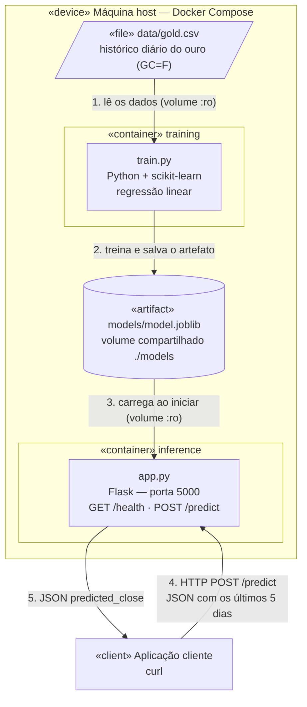
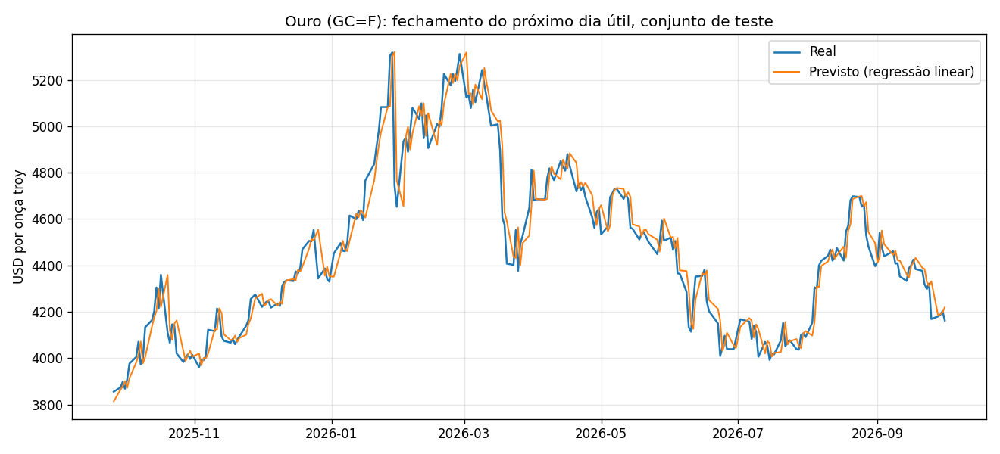
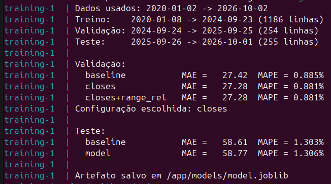
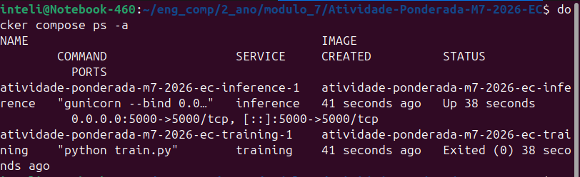
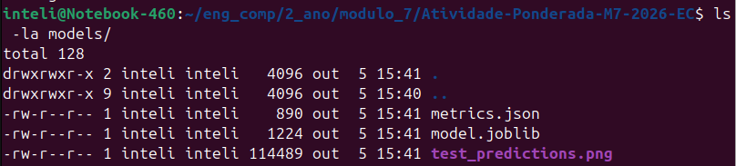
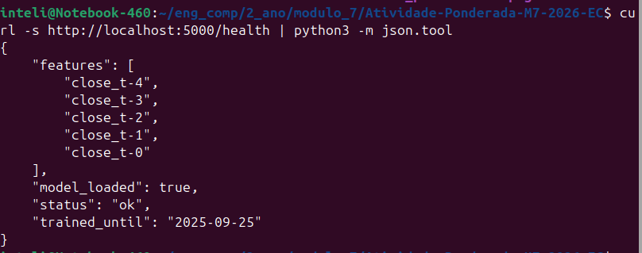
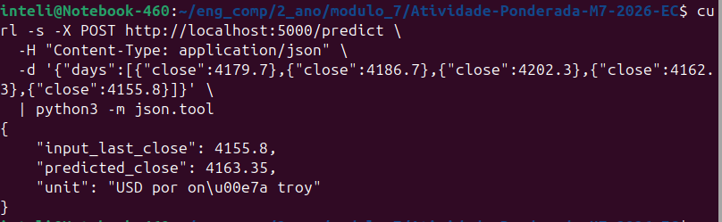
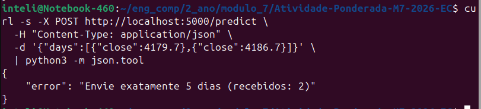
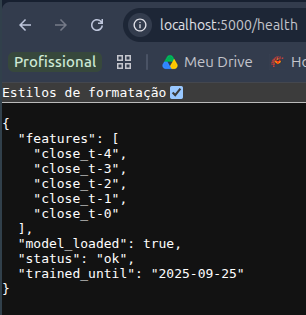

# Documentação da atividade

Nome: Maria Vitória dos Santos

## Dados

Para a atividade escolhi mapear o ouro (não sei se é considerado uma moeda para essa atividade mas foi uma ideia que eu tive que eu achei legal e diferente para mapear kkkkk).
Vou pegar um dataset que tenha frequência diária, usar por horário poderia ser uma saída mas aumentaria muito a volumetria de dados e diminuiria o horizonte de dias, preferi mais dias do que uma precisão mais específica de horário.
Peguei uma base história desde 2020, o que é uma base com um volume de dados significativa, e também o máximo disponível no seguinte site: https://finance.yahoo.com/quote/GC=F/history/?period1=967608000&period2=1791221427.
Vou tentar usar o máximo de dados disponíveis, caso o modelo demore muito, vou começar a reduzir.
E por fim vou baixar um csv dentro de /data, assim o modelo não depende de conexão com a internet e nem de nada externo, evitando falhas.
Nessa eu descobri que o ouro só é negociado nos dias úteis, então o modelo preveria o valor do próximo dia útil e não exatemnte do próximo dia, mas isso não impacta no modelo, apenas para o entedimento do leitor e usuário.

### CSV

Para baixar os dados usei o comando:

```bash
pip install yfinance
python -c "import yfinance as yf; yf.download('GC=F', start='2020-01-01', interval='1d', multi_level_index=False).to_csv('data/gold.csv')"
```

Os dados ficam salvos dentro de /data e com as colunas de dia, preço de abertura, preço máximo do dia, preço mínimo do dia, preço de fechamento e volume de contratos. Minha ideia é prever para o próximo dia útil o preço de fechamento, então vou usar ele como variável alvo. 

### Validação e tratamento dos dados

Antes de treinar, validei alguns pontos:
1. Não utilizar o dia de hoje por não ter fechado ainda.
2. Tenho a ideia de separar por tempo, sem embaralhar a base de dados, uma vez que a data é importante
3. 70% da base para treino, 15% para validação e 15% para teste (basicamente testamos com o último ano)

### Features

Minha ideia é não utilizar o volume por refletir o vencimento do contrato e não o quanto o mercado tá interessado. E não usar o valor máximo e mínimo diretamete, queria testar usar a diferença entre um e outro. Quero utilizar os últimos 5 dias para prever o próximo.

## Modelo

Quero usar regressão linear por ser um modelo que pode prever valores fora da faixa de treino, é um modelo simples e de fácil treinamento. Ao dar minha ideia para a IA de usar a amplitude de valor máximo - valor mínimo ela me sugeriu usar a amplitude relativa que é essa amplitude dividida pelo preço de fechamento, acredito ser uma boa, vou testar com essa feature.
Com mais tempo de atividade, quero comparar com um modelo simples, analisando os dados se há tendencia ou ciclo para utilizar um Holt ou algo do tipo, mas vou focar no momento apenas no modelo de regressão linear.
Vou rodar o treinamento em um container docker, com um script train.py dentro da pasta training/, em vez de usar um notebook. Isso foi para garantir a reprodutibilidade do modelo em qualquer máquina e para qualquer pessoa. O artefato é salvo dentro de /models.
Minha ideia era fazer um notebook pela questão de visualização e exploração mas verificando com a IA, teria mais riscos de versão pois rodaria fora do docker.

## Backend

Escrito em python utilizando Flask por ser mais simples e utilizando testes no curl. E também por eu ter mais conhecimento.

## Inferência

Vou usar volume compartilhado dos dois conteiners que enxergam a pasta /models. O container de treinamento pega os dados dentro de /data, treina e salva em /models. O container de inferência carrega o modelo. E tudo isso é configurado dentro do docker-compose.yml.

## Diagrama UML

Depois de detalhar toda a minha ideia e minha discussao que foi documentada acima, gerei o diagrama com o uso de IA, fiz um diagrama de componentes pois mostra como a aplicação roda e como ela funciona, a conexão dos dois containers e a comunicação de toda a solução:



O diagrama mostra os componentes da solução e como os dados circulam entre eles. Tudo roda na máquina host, pelo docker compose, em dois containers separados.
O container de treinamento lê o histórico do ouro em /data, treina a regressão linear e salva o modelo treinado como artefato em /models. Essa pasta é um volume compartilhado, e é por ela que o modelo chega ao container de inferência: o backend Flask monta a mesma pasta em modo somente leitura e carrega o modelo ao iniciar.
Por fim, o curl envia uma requisição HTTP POST /predict com os dados dos últimos 5 pregões, e o backend responde com a previsão do fechamento do próximo dia útil em JSON. A rota GET /health permite verificar se o serviço está ativo.
(Resumo feito com ajuda da IA)

## Treinamento do Modelo

Após minha decisões o modelo e o requirements foram feitos pela IA, com minha validações de escolhas.
Segue o resumo da IA para o que foi treinado:

> ### Decisões
>
> - **Versões fixas:** foi criado o `training/requirements.txt` com as versões das bibliotecas fixadas (`pandas==2.2.3`, `numpy==2.2.3`, `scikit-learn==1.6.1`, `joblib==1.4.2`, `matplotlib==3.10.0`). O modelo é salvo com `joblib`, e esse arquivo só carrega com segurança se a versão do scikit-learn for a mesma no treino e na inferência, então o container de inferência vai usar as mesmas versões.
> - **Remoção do dia incompleto:** inicialmente a ideia era descartar o dia de hoje comparando com a data atual, mas foi percebido que isso só funcionaria se o treino rodasse no mesmo dia do download do CSV. Por isso, o `train.py` sempre descarta a última linha do CSV, que pode ter sido baixada com o mercado aberto.
> - **Comparação na validação:** o conjunto de validação foi usado para comparar três alternativas: o baseline "amanhã = hoje" (prever que o fechamento de amanhã é igual ao de hoje), a regressão só com os últimos 5 fechamentos e a regressão com os 5 fechamentos mais a amplitude relativa. O script escolhe automaticamente a alternativa com menor MAE.
> - **Modelo final:** depois de escolher a configuração, o modelo é treinado com treino + validação e avaliado uma única vez no teste, para que a métrica de teste seja honesta.
> - **Evidências:** além do modelo, o treino salva as métricas em `models/metrics.json` e um gráfico real vs. previsto em `models/test_predictions.png`.
>
> ### Arquivos criados e alterados
>
> - `training/requirements.txt` (criado): bibliotecas e versões do treino.
> - `training/train.py` (criado): carrega o CSV, cria as features, divide 70/15/15 em ordem cronológica, compara as alternativas na validação, treina o modelo final, avalia no teste e salva o artefato.
> - `training/Dockerfile` (criado): imagem `python:3.12-slim` que instala as dependências e executa o `train.py`.
> - `docker-compose.yml` (alterado): foi adicionado o serviço `training`, que monta `./data` como somente leitura e `./models` para salvar o artefato.
>
> ### Como executar
>
> ```bash
> docker compose build training
> docker compose run --rm training
> ```
>
> Arquivos gerados em `models/`:
>
> - `model.joblib`: o modelo treinado e as informações de quais features ele usa.
> - `metrics.json`: períodos de cada conjunto, métricas e coeficientes do modelo.
> - `test_predictions.png`: gráfico real vs. previsto no conjunto de teste.
>
> ### Resultados
>
> | Conjunto | Modelo | MAE (US$) | MAPE |
> |---|---|---|---|
> | Validação | Baseline "amanhã = hoje" | 27,42 | 0,885% |
> | Validação | Regressão (fechamentos) | 27,28 | 0,881% |
> | Validação | Regressão (fechamentos + amplitude relativa) | 27,28 | 0,881% |
> | Teste | Baseline "amanhã = hoje" | 58,61 | 1,303% |
> | Teste | Regressão (fechamentos) | 58,77 | 1,306% |
>
> 
>
> ### Análise
>
> - A amplitude relativa não melhorou o modelo (empate na validação), então o modelo final usa apenas os últimos 5 fechamentos.
> - A regressão aprendeu praticamente que "o fechamento de amanhã ≈ 0,97 × o fechamento de hoje" (o peso dos outros dias é quase zero), por isso o resultado fica muito próximo do baseline. No gráfico, a previsão parece a linha real deslocada um dia para a direita. Isso é comum em preços de ativos: o preço de hoje já é a melhor estimativa simples para amanhã, e é difícil superar esse baseline apenas com preços passados.
> - O erro no teste (cerca de US$ 58) é o dobro do erro na validação (cerca de US$ 27), porque o período de teste (2025–2026) é bem mais volátil e tem preços acima de tudo o que o modelo viu no treino.

Bsicamente o modelo se parece com um naive e possui uma precisão bastante considerável.

## Backend

Para o backend, a IA gerou as rotas e requisições e realizou os testes, além disso, tudo está compilado em um docker compose que roda com apenas um comando: docker compose up --build

> ### Decisões
>
> - **Formato da entrada:** o `/predict` recebe `{"days": [...]}` com os últimos 5 pregões, do mais antigo para o mais recente. O campo `close` é obrigatório e `high`/`low` são opcionais: o backend lê do artefato se o modelo usa a amplitude relativa (`use_range_rel`) e só exige esses campos nesse caso. Assim, se o modelo for retreinado com outra configuração, o backend continua funcionando sem mudar o código.
> - **Validação manual:** como o Flask não valida a entrada automaticamente, foi implementada uma validação que confere o formato do JSON, a quantidade de dias e se os valores são números positivos, retornando HTTP 400 com uma mensagem clara em caso de erro.
> - **Carregamento do modelo:** o modelo é carregado uma única vez, quando o serviço sobe. Se o artefato não existir, o serviço continua no ar e o `/health` responde HTTP 503 informando que o modelo não foi carregado.
> - **Servidor Gunicorn:** foi usado o Gunicorn em vez do servidor embutido do Flask, que é indicado apenas para desenvolvimento.
> - **Versões iguais ao treino:** `numpy`, `scikit-learn` e `joblib` têm as mesmas versões do container de treinamento, para garantir que o `model.joblib` carregue corretamente. O backend não instala `pandas` nem `matplotlib`, o que deixa a imagem mais leve.
> - **Ordem de execução:** no `docker-compose.yml`, o serviço `inference` depende do `training` com `condition: service_completed_successfully`, ou seja, a inferência só sobe depois que o treino termina com sucesso e o modelo existe.
>
> ### Arquivos criados e alterados
>
> - `inference/requirements.txt` (criado): bibliotecas e versões do backend.
> - `inference/app.py` (criado): carrega o artefato e expõe as rotas `GET /health` e `POST /predict`.
> - `inference/Dockerfile` (criado): imagem `python:3.12-slim` que instala as dependências e sobe o backend com Gunicorn na porta 5000.
> - `docker-compose.yml` (alterado): foi adicionado o serviço `inference`, que expõe a porta 5000, monta `./models` como somente leitura e depende do serviço `training`.
>
> ### Como executar
>
> ```bash
> docker compose up --build
> ```
>
> Esse comando executa o treinamento, gera o modelo em `models/` e depois sobe o backend em `http://localhost:5000`. Para encerrar: `docker compose down`.
>
> ### Rotas
>
> | Rota | Descrição |
> |---|---|
> | `GET /health` | Verifica se o serviço está ativo e se o modelo foi carregado |
> | `POST /predict` | Recebe os últimos 5 pregões e retorna a previsão do fechamento do próximo dia útil |
>
> ### Testes
>
> ```bash
> curl http://localhost:5000/health
> ```
> ```json
> {"features":["close_t-4","close_t-3","close_t-2","close_t-1","close_t-0"],"model_loaded":true,"status":"ok","trained_until":"2025-09-25"}
> ```
>
> ```bash
> curl -X POST http://localhost:5000/predict \
>   -H "Content-Type: application/json" \
>   -d '{"days":[{"close":4179.7},{"close":4186.7},{"close":4202.3},{"close":4162.3},{"close":4155.8}]}'
> ```
> ```json
> {"input_last_close":4155.8,"predicted_close":4163.35,"unit":"USD por onça troy"}
> ```
>
> | Teste de erro | Resposta | HTTP |
> |---|---|---|
> | Enviar 4 dias | `Envie exatamente 5 dias (recebidos: 4)` | 400 |
> | Texto no lugar de número | `days[0].close deve ser um número positivo` | 400 |
> | Corpo que não é JSON | `O corpo deve ser um JSON no formato {"days": [...]}` | 400 |

## Evidências

Rodando docker compose up --build o container de treino le o csv
Evidências da execução completa, partindo do zero (`docker compose down` e pasta `models/` vazia).
>
> **1. Treinamento no container:** `docker compose up --build`. O container `training` lê o CSV, mostra a divisão cronológica, compara as alternativas na validação, avalia no teste e salva o artefato.
>
> 
>
> **2. Estado dos containers:** `docker compose ps -a`. O `training` terminou com `Exited (0)`, ou seja, o treino rodou com sucesso, e o `inference` está ativo (`Up`), expondo a porta 5000.
>
> 
>
> **3. Artefato gerado:** `ls -la models/`. Os arquivos `model.joblib`, `metrics.json` e `test_predictions.png` foram criados no horário da execução, pelo volume compartilhado.
>
> 
>
> **4. Health check:** `curl -s http://localhost:5000/health | python3 -m json.tool`. O serviço está ativo e o modelo foi carregado no container de inferência.
>
> 
>
> **5. Predição:** `POST /predict` com os últimos 5 fechamentos. O backend retornou a previsão do fechamento do próximo dia útil (US$ 4.163,35). O `onça` no print é apenas a formatação do `python3 -m json.tool`, que escapa caracteres acentuados; a resposta do backend é `onça`.
>
> 
>
> **6. Validação da entrada:** `POST /predict` com apenas 2 dias. O backend recusou a requisição com uma mensagem clara.
>
> 
>
> **7. Health check pelo navegador:** acesso a `http://localhost:5000/health`.
>
> 
>
> **8. Docker Desktop:** o projeto `atividade-ponderada-m7-2026-ec` em execução.
>
> 

## Como reproduzir

> **Pré-requisitos:** Git e Docker com Docker Compose (no Linux, o Docker Desktop precisa estar aberto). Não é necessário instalar Python nem bibliotecas na máquina: tudo roda dentro dos containers.
>
> 1. Clonar o repositório:
>
>    ```bash
>    git clone https://github.com/mavisanttos/Atividade-Ponderada-M7-2026-EC.git
>    cd Atividade-Ponderada-M7-2026-EC
>    ```
>
> 2. Treinar o modelo e subir o backend com um único comando:
>
>    ```bash
>    docker compose up --build
>    ```
>
>    O container `training` lê `data/gold.csv`, treina o modelo, salva os artefatos em `models/` e encerra. Em seguida, o container `inference` sobe o backend em `http://localhost:5000`.
>
> 3. Em outro terminal, verificar se o serviço está ativo:
>
>    ```bash
>    curl http://localhost:5000/health
>    ```
>
> 4. Solicitar uma predição, enviando os últimos 5 fechamentos (do mais antigo para o mais recente):
>
>    ```bash
>    curl -X POST http://localhost:5000/predict \
>      -H "Content-Type: application/json" \
>      -d '{"days":[{"close":4179.7},{"close":4186.7},{"close":4202.3},{"close":4162.3},{"close":4155.8}]}'
>    ```
>
> 5. Encerrar:
>
>    ```bash
>    docker compose down
>    ```
>
> **Atualizar os dados (opcional):** para treinar com dados mais recentes, basta baixar o CSV novamente com o comando da seção [CSV](#csv) e rodar `docker compose up --build` de novo. O CSV não é baixado durante o build, então a execução não depende de internet.

## Dificuldades encontradas

> - **Dia incompleto no CSV:** os dados foram baixados com o mercado aberto, então a última linha não tinha o fechamento real. A primeira ideia foi descartar as linhas com a data de hoje, mas isso só funcionaria no mesmo dia do download. A solução foi o `train.py` sempre descartar a última linha do CSV.
> - **Volume pouco confiável:** o `GC=F` é um contrato futuro contínuo, e o volume despenca perto das trocas de contrato (vencimentos). Por isso, o volume foi descartado como feature.
> - **Preços fora da faixa do treino:** o ouro subiu de cerca de US$ 1.500 (2020) para mais de US$ 5.000 (2026), então o conjunto de teste tem preços acima de tudo o que o modelo viu no treino. Isso influenciou a escolha da regressão linear, que consegue extrapolar, ao contrário de modelos de árvore.
> - **Amplitude relativa sem ganho:** a hipótese de que a amplitude relativa `(high - low) / close` ajudaria não se confirmou: empatou com o modelo só com fechamentos na validação, então a configuração mais simples foi mantida.
> - **Modelo próximo do baseline:** a regressão praticamente repete o preço do dia anterior. Em vez de esconder esse resultado, ele foi comparado explicitamente com o baseline "amanhã = hoje" e documentado na análise.
> - **Docker Desktop desligado:** na primeira tentativa de rodar o treino, o Docker não estava ativo (`failed to connect to the docker API`). Foi resolvido abrindo o Docker Desktop antes de executar o `docker compose`.

## Limitações conhecidas

> - **Não supera o baseline:** o modelo tem desempenho praticamente igual a prever que o fechamento de amanhã será igual ao de hoje (MAE de US$ 58,77 contra US$ 58,61 no teste). Na prática, ele não acrescenta poder de previsão além do último preço conhecido.
> - **Só usa preços passados:** o modelo não considera fatores que movem o preço do ouro, como dólar, juros, inflação, notícias e eventos geopolíticos.
> - **Dados estáticos:** o CSV vai até 2026-10-05. O backend não busca dados atualizados: quem faz a requisição precisa informar os últimos 5 fechamentos, e para atualizar o modelo é preciso baixar um novo CSV e retreinar.
> - **Modelo final não viu o último ano:** o artefato foi treinado com treino + validação (até 2025-09-25), para que o teste fosse uma avaliação honesta. Uma melhoria seria retreinar com todos os dados depois da avaliação, antes de disponibilizar o modelo.
> - **Contrato futuro contínuo:** o `GC=F` emenda contratos com vencimentos diferentes, o que pode gerar pequenos saltos de preço nas trocas de contrato.
> - **Horizonte e incerteza:** o modelo prevê apenas o próximo dia útil e retorna um único valor, sem intervalo de confiança.
> - **Infraestrutura simples:** o modelo é compartilhado por volume, sem versionamento ou registro de modelos (como MLflow). O backend não tem autenticação, HTTPS nem testes automatizados, e o retreino é manual.
> - **Uso experimental:** as predições servem apenas para demonstrar a integração entre treinamento, artefato, container de inferência e cliente, e **não devem ser interpretadas como recomendação de investimento**.

## Melhorias futuras

> - Retreinar o modelo final com todos os dados disponíveis após a avaliação.
> - Testar modelos de séries temporais com tendência, como Holt, e prever a variação percentual em vez do preço.
> - Incluir variáveis externas, como índice do dólar (DXY) e taxa de juros.
> - Versionar os modelos com um registro (MLflow ou bucket S3) e automatizar o retreino.
> - Adicionar testes automatizados para as rotas do backend.
